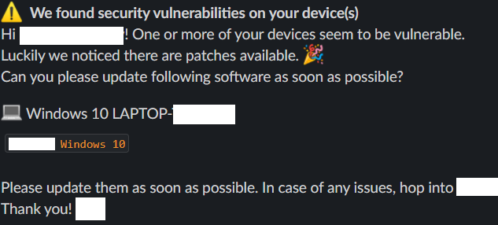

# 🤖 security-slacker
Nags users on Slack about outstanding risks found by Crowdstrike Spotlight or vmware Workspace ONE so they can secure their own endpoint.

Self-service security culture! :partying_face:

Slack message for the user:



Slack overview message for the security user:


## Instructions

1. Tag your Falcon hosts with `email/user/company/com` if their email is `user@company.com`.
2. Assign compliance policies to your devies in Workspace ONE. 
3. Fetch a binary release or Docker image from [Releases](https://github.com/hazcod/crowdstrike-spotlight-slacker/releases).
4. Create a Falcon API token to use in `API Clients and Keys` with `Read` permission to `Hosts` and `Spotlight`.
5. Create a Workspace ONE API token and user to use.
6. Create a configuration file:
```yaml
slack:
  # slack bot token
  token: "XXX"
  # Slack user that receives  messages if the user is not found
  security_user: "security@mycompany.com"
  # skip sending a security overview if there is nothing to mention
  skip_no_report: true

# falcon crowdstrike
falcon:
  # falcon api credentials
  clientid: "XXX"
  secret: "XXX"
  # your falcon SaaS cloud region
  cloud_region: "eu-1"
  # skip vulnerabilities without available patches
  skip_no_mitigation: true

# vmware workspace one
ws1:
  api_url: "https://xxx.awmdm.com/api/"
  api_key: "XXX"
  user: "XXX"
  password: "XXX"

# email domains used in your Slack workspace for filtering
# e.g. for a Slack account user@mycompany.com
email.domains: ["mycompany.com"]

# what is sent to the user in Go templating
templates:
  user_message: |
    *:warning:  We detected security issues on your device(s)*
    Hi {{ .Slack.Profile.FirstName }} {{ .Slack.Profile.LastName }}!

    {{ if not (eq (len .Falcon.Devices) 0) }}
    One or more of your devices seem to be vulnerable.
    Luckily we noticed there are patches available. Please install following patches:
    {{ range $device := .Falcon.Devices }}
    :computer: {{ $device.MachineName }}
    {{ range $vuln := $device.Findings }}
      `{{ $vuln.ProductName }}`
    {{ end }}
    {{ end }}
    {{ end }}

    {{ if not (eq (len .WS1.Devices) 0) }}
    One or more of your devices seem to be misconfigured in an insecure way.
    Please check the below policies which are violated:
    {{ range $device := .WS1.Devices }}
    :computer: {{ $device.MachineName }}
    {{ range $finding := $device.Findings }}
    - :warning: {{ $finding.ComplianceName }}
    {{ end }}
    {{ end }}
    {{ end }}

    Please resolve those issues as soon as possible. In case of any issues, hop into *#security*.
    Thank you! :wave:

  security_overview_message: |

    :information_source: *Device Posture overview* {{ .Date.Format "Jan 02, 2006 15:04:05 UTC" }}

    {{ if and (not .Falcon) (not .WS1) }}Nothing to report!  :white_check_mark: {{ else }}

    {{ range $result := .Falcon }}
    :man-surfing: *{{ $result.Email }}*
    {{ range $device := $result.Devices }}
      :computer: {{ $device.MachineName}}
      {{ range $vuln := $device.Findings }}- {{ $vuln.ProductName }} ({{ $vuln.CveSeverity }}) ({{ $vuln.TimestampFound }}) ({{ $vuln.CveID }}){{ end }}
    {{ end }}
    {{ end }}

    {{ range $result := .WS1 }}
    :man-surfing: *{{ $result.Email }}*
    {{ range $device := $result.Devices }}
      :computer: {{ $device.MachineName }}
      Compromised: {{ $device.Compromised }}
      Last seen: {{ $device.LastSeen.Format "Jan 02, 2006 15:04:05 UTC" }}
      {{ range $finding := $device.Findings }}- :warning: {{ $finding.ComplianceName }}{{ end }}
    {{ end }}
    {{ end }}
    {{ end }}

    {{ if .Errors }}
    :warning: *Errors:*
    {{ range $err := .Errors }}
    - {{ $err }}
    {{ end }}
    {{ end }}
```
4. Run `css -config=your-config.yml -log=debug -dry` to test.
5. See the security overview popup to you in Slack!
6. Now run it for real with `css -config=your-config.yml`.
