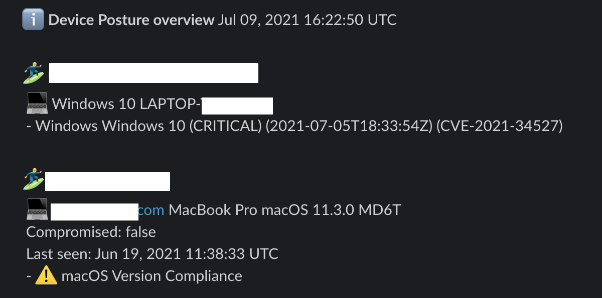

# crowdstrike-spotlight-slacker
Nags users on Slack about outstanding application vulnerabilities found by Crowdstrike Spotlight so they patch their software.



## Instructions

1. Tag your Falcon hosts with `email/user/company/com` if their email is `user@company.com`.
2. Download a release of css from here.
3. Create a configuration file:

```yaml
slack:
  # slack bot token
  token: "XXX"
  # Slack user that receives  messages if the user is not found
  fallback_user: "security@mycompany.com"

falcon:
  clientid: "XXX"
  secret: "XXX"
  cloud_region: "eu-1"

email:
  # email domain
  domain: "mycompany"

# what is sent to the user in Go templating
message: |
  *:warning:  We found security vulnerabilities on your device(s)*
  Hi {{ .Slack.Profile.FirstName }} {{ .Slack.Profile.LastName }}! One or more of your devices seem to be vulnerable.
  Luckily we noticed there are patches available. :tada:
  Can you please update following software as soon as possible?

  {{ range $device := .User.Devices }}
  :computer: {{ $device.MachineName }}
  {{ range $vuln := $device.Findings }}
    `{{ $vuln.ProductName }}`
  {{ end }}
  {{ end }}

  Please update them as soon as possible. In case of any issues, hop into *#security*.
  Thank you! :wave:
```
4. Run `css -config=your-config.yml`.
5. See it popup in Slack!
